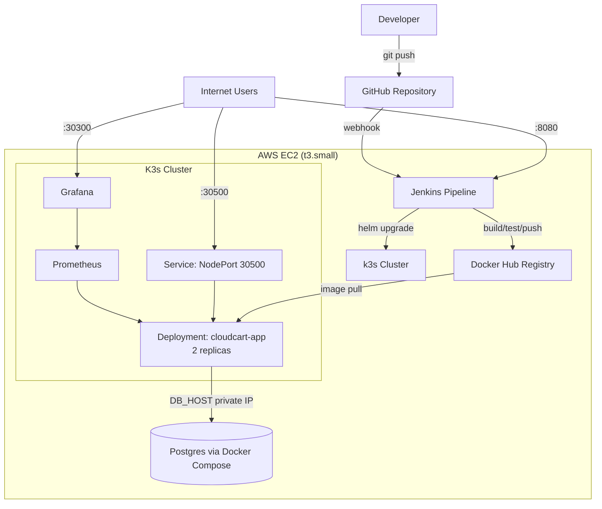

# Architecture

## Overview

CloudCart is a Flask e-commerce storefront deployed on a single AWS EC2 instance, provisioned via Terraform, configured via Ansible, and running under Kubernetes (k3s) with CI/CD automation through Jenkins.

## Diagram

## Components

| Component | Role |
|---|---|
| Terraform | Provisions the EC2 instance, security group, and networking |
| Ansible | Configures the instance: Docker, k3s, Helm, Jenkins, swap, namespace/service |
| Docker | Containerizes the Flask app; also runs Postgres via Compose |
| Jenkins | CI/CD: build, test, push to Docker Hub, deploy via Helm |
| k3s | Lightweight Kubernetes running the application |
| Helm | Packages and versions the Kubernetes deployment |
| Prometheus | Collects metrics from the cluster and node |
| Grafana | Visualizes metrics collected by Prometheus |

## Network flow

1. A developer pushes code to `main` on GitHub.
2. GitHub's webhook notifies Jenkins, which checks out the code, builds a Docker image, runs a smoke test, and pushes the image to Docker Hub.
3. Jenkins SSHes into the EC2 instance and runs `helm upgrade`, which tells Kubernetes to roll out the new image.
4. The application connects to Postgres (running via Docker Compose on the same host) using the instance's private IP, since both are on the same machine.
5. External users reach the application through the Kubernetes NodePort Service (port 30500), Jenkins (port 8080), and Grafana (port 30300), all restricted at the AWS Security Group level.
